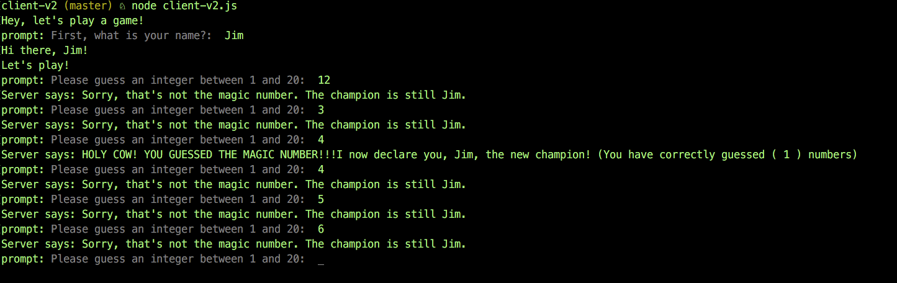

# Number-Guessing-Node-Command-Line-MMOG
A simple text-based online multiplayer game made in nodeJS.

## Backstory
Back in the day (like 2013) I was making online multiplayer Flash games with backends like Electroserver 5 (Java) and Yahoo Games Network (C#). After leaving the Actionscript world for JavaScript I got stucked into the front-end world of Angular and React and NPM. I started using NodeJS for build scripts and AWS Lambda functions. I wanted to get away from hosted-for-you-and-use-our-api solutions and make the server with basically just raw JavaScript that I could run on a linux box. This project was my first foray into the world of websockets and the "ws" library. I think this is a nice example to start with because both the client and the server are in the command line.

## What It Is

## Usage

